# CloudSat Processing

## Description

This project is to implement pre-processing on CloudSat 2B-FLXHR-LIDAR dataset. The pre-processing includes the binning of swath data into EAR5 grid, and generates a domain-mean profile for each grid that has more than 1 bin inside.

## Data Introduction

Dataset employed in this project is  dataset from circum-polar satellite launched by NASA. Available variables include radiation fluxes, radiative heating rate, and cloud optical depth. This data is constructed as a swath-like data, where the primitive dataset is saved each swath.

For radiation fluxes, the height level is staggered against heating rate, i.e. the height coordinate is one-grid greater than heating rate and other variables.

### Radiative Heating Rate ($Q_r$)

Radiative heating rate (variable name `qr` in file) is stored as two-byte integers in primitive file. All the values have been multiplied by 100 to ensure the numerical accuracy. For **original value**, i.e. with multiplying 100, the value of $Q_r$ is bounded by $-200 \sim 200$ K d$^{-1}$, and the missing value is set as $-999$ K d$^{-1}$

## Algorithm

Current algorithm is designed for general variables, but the portion of tackling the interpolation of staggered grid is not developed yet. Here, the algorithm used to process radiative heating rate is demonstrated:

```mermaid
flowchart LR
    %% Styling
    classDef process fill:#f9f9f9,stroke:#333,stroke-width:2px;
    classDef data fill:#e1f5fe,stroke:#0288d1,stroke-width:2px;
    classDef pool fill:#fff3e0,stroke:#f57c00,stroke-width:2px;
    classDef endpoint fill:#e8f5e9,stroke:#388e3c,stroke-width:2px;

    %% Main Script Flow
    Start([Start: Script Execution]):::endpoint --> Init[Parse Year/Date Arguments]:::process
    Init --> LoadERA5[(Load ERA5 Grid\nlat, lon, z)]:::data
    LoadERA5 --> MP{Multiprocessing Pool\nMax Workers: 8}:::pool

    %% Worker Process Subgraph
    subgraph Workers [Parallel Worker Processes per .hdf File]
        direction TB
        Read[(Read Data:\nCloudSat Swath)]:::data --> Bin[Apply Binning:\nAssign Swath to 2D Grid]:::process
        Bin --> Interp[Interpolation:\nAlign Swath Height to Z-levels]:::process
        Interp --> Accum[Local Accumulation:\nlocal_qr_sum & local_qr_cnt]:::process
    end

    %% Connections
    MP == Assigns File ==> Read
    Accum == Returns Arrays ==> Agg[Aggregate Results:\nMaster qr_sum & qr_cnt]:::process
    
    %% Final Processing
    Agg --> Avg[Average:\nqr_sum / qr_cnt]:::process
    Avg --> Store[(Store:\nSave as NetCDF .nc)]:::data
    Store --> Done([End]):::endpoint
```

### Load file

In this procedure, two datasets are adopted, including CloudSat dataset and ERA5 geopotential dataset. The ERA5 geopotential data set is used to generate assign geopotential height value, so as to interpolate radiative heating rate onto specific pressure level. Due to the data format of CloudSat is HDF4, `pyhdf` package is used